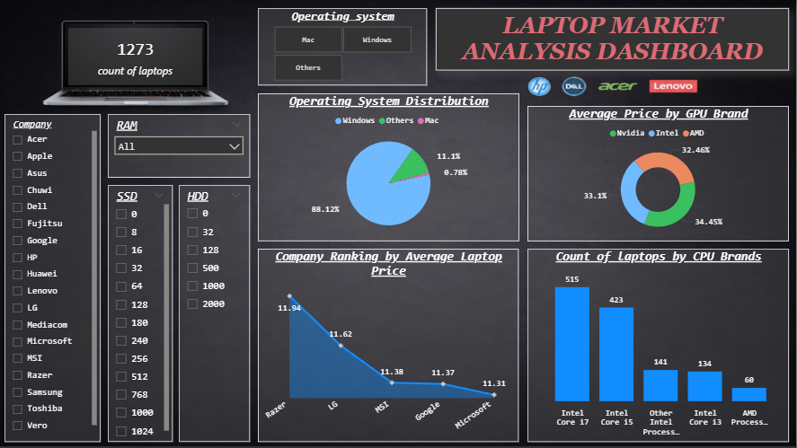

# Laptop Market Analysis Dashboard – Power BI

## Project Overview
This project is an interactive Power BI dashboard designed to analyze laptop sales
based on brand, operating system, CPU, GPU, RAM, storage, and pricing.
The dashboard provides insights into market distribution, average pricing,
and hardware preference trends.

## Dashboard Screenshot

## Objectives
- Analyze total number of laptops in the dataset
- Understand operating system distribution
- Compare average prices by GPU brand
- Analyze laptop count by CPU brand
- Rank companies by average laptop price
- Enable interactive filtering by specifications

## Tools & Technologies
- Power BI Desktop
- DAX (Data Analysis Expressions)
- Laptop Sales Dataset

## Dashboard Features
- KPI:
  - Total Laptop Count

- Visualizations:
  - Operating System Distribution (Pie Chart)
  - Average Price by GPU Brand (Donut Chart)
  - Laptop Count by CPU Brand (Bar Chart)
  - Company Ranking by Average Laptop Price (Line Chart)

- Filters & Slicers:
  - Company
  - RAM
  - SSD
  - HDD
  - Operating System

- Interactivity:
  - Cross-filtering across visuals
  - Dynamic slicer-based analysis
  - Clean and professional layout

## Key Insights
- Windows laptops dominate the market
- NVIDIA GPUs are associated with higher average prices
- Intel CPUs are most commonly used
- Premium brands show higher average pricing
- AMD CPUs have lower market share compared to Intel

## Dataset Information
- Dataset includes laptop specifications and pricing
- Columns include:
  - Company
  - Operating System
  - CPU Brand
  - GPU Brand
  - RAM
  - SSD and HDD Storage
  - Price

## How to Use
1. Download the Power BI (.pbix) file
2. Open using Power BI Desktop
3. Use slicers to explore insights
4. Analyze trends and comparisons interactively

## Future Enhancements
- Add price range categorization
- Include performance benchmarks
- Add trend analysis over time
- Publish to Power BI Service

## Author
Kadiri Kousalya  
Data Analyst | Power BI Developer
